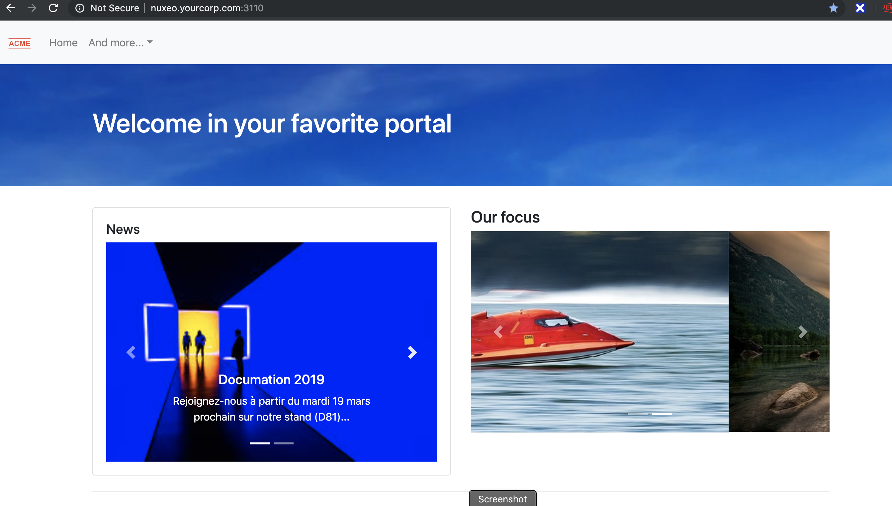

# nuxeo-node-example

Nuxeo integration portal example, based on Node.js.



## Launch

Edit your own **.env** file (look at .env.example)

```dotenv
NUXEO_URL=http://localhost:8080/nuxeo/
NUXEO_LOGIN=XXX
NUXEO_PASSWORD=XXX
NUXEO_PUBLIC_URL=http://yourNuxeoPublicUrl:8080/nuxeo/
``` 

then launch :

```bash
npm start
```

and look at http://localhost:3000/

edit your freshly created **data/home.json** config file to customize branding.

## Docker

It's possible to include project in a Docker compose, with a container like 

```dockerfile
#Dockerfile
FROM node:lts-jessie
USER root
RUN npm i nuxeo-node-example -g
CMD nuxeo-node-example
EXPOSE 3000
```

and a compose like

```yaml
#docker-compose.yml
version: '3'
services:
  node:
    build:
      context: .
      dockerfile: Dockerfile
    ports:
      - "3000:3000"
    environment:
      NUXEO_URL: "http://localhost:8080/nuxeo"
      NUXEO_LOGIN: Administrator
      NUXEO_PASSWORD: xxxx
      NUXEO_PUBLIC_URL: "http://yourNuxeoPublicUrl:8080/nuxeo"
    volumes:
      - ".data:/usr/local/lib/node_modules/nuxeo-node-example/data"   
```


## Features

- [x] Demonstrate Nuxeo Node.js SDK Features
- [x] Test your Nuxeo speed efficiency
- [x] Add a NXQL access
- [ ] Test import features (Help needed)


## Support

@mat_cloud

Please pull request !

